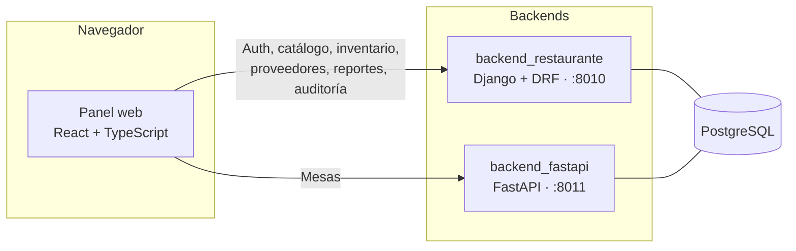
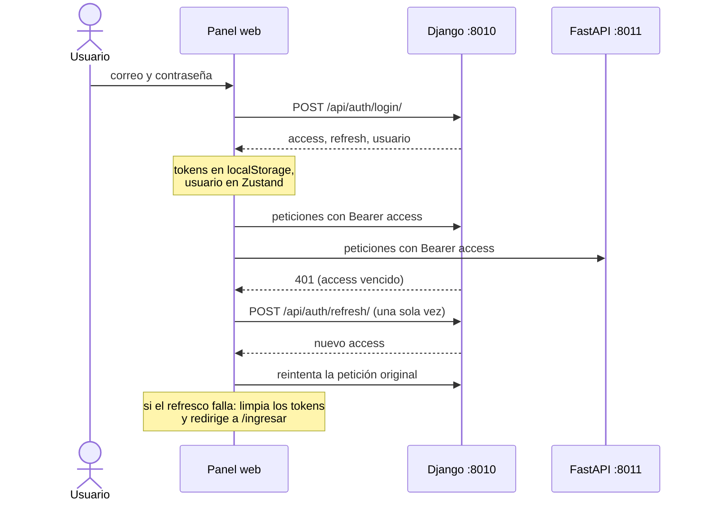

<div align="center">

# Panel de administración para restaurantes

Aplicación web para gestionar la carta y sus recetas, el inventario, las compras a proveedores, el equipo y la auditoría de un restaurante, con un resumen de ventas y el estado del salón.


</div>

---

## Contenido

- [Sobre el proyecto](#sobre-el-proyecto)
- [Funcionalidades](#funcionalidades)
- [Stack tecnológico](#stack-tecnológico)
- [Arquitectura](#arquitectura)
- [Puesta en marcha](#puesta-en-marcha)
- [Variables de entorno](#variables-de-entorno)
- [Docker](#docker)
- [Estructura del proyecto](#estructura-del-proyecto)
- [API consumida](#api-consumida)
- [Sesión y autenticación](#sesión-y-autenticación)
- [Roles y acceso](#roles-y-acceso)
- [Diseño](#diseño)
- [Calidad y pruebas](#calidad-y-pruebas)
- [Solución de problemas](#solución-de-problemas)
- [Limitaciones conocidas](#limitaciones-conocidas)

## Sobre el proyecto

En un restaurante, el stock real rara vez coincide con lo que se cree tener: cada plato consume ingredientes y nadie los descuenta a mano. Aquí cada producto de la carta tiene una **receta** (los insumos que consume una unidad) y el sistema descuenta el stock al venderse. Este panel es donde se ve el resultado y se administra el resto: ventas del día, stock frente al mínimo, compras por recibir, equipo y auditoría.

Este directorio es el **panel web**. Forma parte de un monorepo con otras tres piezas (ver el [README raíz](../README.md)):

| Carpeta | Stack | Puerto |
|---|---|---|
| [`backend_restaurante`](../backend_restaurante) | Django 5 + DRF | 8010 |
| [`backend_fastapi`](../backend_fastapi) | FastAPI + SQLAlchemy async | 8011 |
| `frontend_restaurante` (este) | React 19 + TypeScript + Vite | 5174 |
| [`frontend_movil_restaurante`](../frontend_movil_restaurante) | Flutter | — |

El panel consume los dos backends. Los pedidos se toman desde la app móvil; aquí se consultan y se auditan.

<!-- TODO: añadir capturas del panel (Resumen del día, Mesas, Productos y recetas) en docs/screenshots/ y enlazarlas aquí. -->

## Funcionalidades

| Módulo | Ruta | Qué permite |
|---|---|---|
| Resumen del día | `/` | Tarjetas de ventas de hoy, pedidos en curso, mesas ocupadas e insumos bajo mínimo. Ventas de los últimos 14 días (solo pedidos entregados), productos más pedidos, ingresos por categoría (30 días), alertas de stock e insumos más consumidos. Resumen y alertas se refrescan cada 30 s. |
| Pedidos | `/pedidos` | Historial con filtro por estado (pendiente, preparando, listo, entregado, cancelado). Solo lectura. Refresco cada 20 s. |
| Mesas | `/mesas` | Vista del salón con un plano SVG por mesa (redonda hasta 4 comensales, rectangular si son más), estado libre / ocupada / reservada y cuenta en curso. Refresco cada 15 s. |
| Productos y recetas | `/productos` | Alta, edición y retiro de productos con búsqueda. Gestión de la receta de cada producto: insumo y cantidad por unidad. |
| Insumos | `/insumos` | Alta y edición con búsqueda, nivel de stock frente al mínimo y ajuste por conteo físico, que queda registrado como movimiento de inventario. |
| Movimientos | `/inventario` | Alertas de stock sin atender (marcar como atendida), historial con filtro por tipo y registro manual de entradas, salidas por merma y ajustes. Contador de alertas pendientes en el menú. |
| Proveedores y compras | `/proveedores` | Órdenes de compra con varias líneas (crear, recibir, cancelar) y alta o edición de proveedores. |
| Usuarios | `/usuarios` (admin) | Alta, edición, desactivación y reactivación. Roles `admin`, `inventario`, `mesero` y `cocina`. Contraseña de al menos 8 caracteres. |
| Auditoría | `/auditoria` (admin) | Registro de operaciones de escritura: fecha, responsable, acción, entidad, referencia e identificador de petición. |

Transversal a todo el panel:

- Autenticación JWT con renovación automática del token.
- Rutas protegidas y rutas exclusivas de administrador.
- Estados de carga y de vacío en las vistas de datos, y mensajes de error en formularios y login.
- Formato regional `es-PE` (moneda en soles, `S/`).
- Modales accesibles (`role="dialog"`, cierre con `Esc`).

## Stack tecnológico

| Capa | Tecnología | Uso en el proyecto |
|---|---|---|
| UI | React 19 | Componentes y hooks |
| Lenguaje | TypeScript 6.0 | Tipado estricto (`strict` viene activado por defecto en TS 6) |
| Build y desarrollo | Vite 8 + `@vitejs/plugin-react` | Servidor de desarrollo y empaquetado |
| Rutas | React Router 7 (`react-router-dom`) | Rutas y guardas por rol |
| Estado del servidor | TanStack Query 5 | Caché, revalidación, polling e invalidación tras cada mutación |
| Estado del cliente | Zustand 5 | Solo la sesión: es el único estado global de cliente |
| HTTP | Axios | Dos instancias (Django y FastAPI) con interceptores |
| Gráficos | Recharts 3 | Líneas y barras del resumen |
| Animación | Framer Motion 12 | Transiciones de página, tarjetas y modales |
| Estilos | CSS propio con variables | Sin framework de utilidades |
| Lint | Oxlint | Reglas `react`, `typescript` y `oxc` |
| Contenedores | Docker + nginx 1.27 | Build en Node 22 Alpine y servido estático |
| Tipografías | Google Fonts | Bricolage Grotesque, Public Sans y JetBrains Mono, cargadas desde `index.html` |

## Arquitectura



Ambos backends comparten la base de datos PostgreSQL y el `JWT_SECRET` (detalle en el [README raíz](../README.md)).

Dentro del frontend, las capas son:

```
routes  →  features/*  →  api/endpoints/*  →  api/client.ts (Axios ×2)
             │
             └─ TanStack Query (estado del servidor)   ·   Zustand (solo la sesión)
```

- **Estado del servidor:** `QueryClient` con `retry: 1`, `refetchOnWindowFocus: false` y `staleTime` de 20 s. Cada mutación invalida las consultas afectadas (por ejemplo, registrar un movimiento refresca `movimientos`, `alertas`, `insumos` y `resumen`).
- **Actualización periódica:** `refetchInterval` en Resumen (30 s), alertas (30 s), Pedidos (20 s) y Mesas (15 s).
- **Una carpeta por dominio** en `features/`, con su CSS al lado.

## Puesta en marcha

### Requisitos previos

- **Node.js** `^20.19` o `>=22.12` (requisito de Vite 8) y **npm**.
- Los dos backends y PostgreSQL en ejecución: Django en `:8010` y FastAPI en `:8011`. La preparación está en el [README raíz](../README.md).
- Para tener datos y cuentas de prueba, ejecutar `python manage.py seed_demo` en `backend_restaurante`. Las credenciales de demostración están en el README raíz.

### Instalación y ejecución

```bash
cd frontend_restaurante
npm install
cp .env.example .env        # PowerShell: Copy-Item .env.example .env
npm run dev                 # http://localhost:5174
```

El puerto `5174` es fijo (`strictPort`): si está ocupado, Vite se detiene en lugar de elegir otro, porque los backends esperan ese origen.

### Scripts disponibles

| Comando | Descripción |
|---|---|
| `npm run dev` | Servidor de desarrollo en `http://localhost:5174` |
| `npm run build` | Comprueba tipos (`tsc -b`) y compila a `dist/` |
| `npm run preview` | Sirve la compilación en `http://localhost:4173` (puerto por defecto de Vite) |
| `npm run lint` | Ejecuta Oxlint |

> `npm run preview` usa el origen `:4173`, que los backends no permiten por defecto en CORS. Para probar el login desde ahí hay que añadir ese origen a su configuración.

## Variables de entorno

Se definen en `.env` (copia de `.env.example`). Vite solo expone al código las variables con prefijo `VITE_`.

| Variable | Valor por defecto | Descripción |
|---|---|---|
| `VITE_API_DJANGO` | `http://localhost:8010` | URL base de `backend_restaurante` |
| `VITE_API_FASTAPI` | `http://localhost:8011` | URL base de `backend_fastapi` |

- Vite las **incrusta en el bundle durante el build**, no en tiempo de ejecución. Tras cambiarlas hay que reiniciar `npm run dev` o volver a compilar.
- Al ser públicas en el navegador, **no deben contener secretos**.
- `.env` no se versiona; solo `.env.example`.

## Docker

El `Dockerfile` compila en dos etapas (Node 22 Alpine → nginx 1.27 Alpine). `nginx.conf` devuelve `index.html` para cualquier ruta desconocida, porque el enrutado es del lado del cliente, y cachea los recursos estáticos 30 días.

**Sistema completo** (desde la raíz del monorepo, donde está `docker-compose.yml`):

```bash
docker compose up --build   # panel en http://localhost:5174
```

**Solo el panel**, apuntando a backends ya levantados:

```bash
docker build -t sazon-panel --build-arg VITE_API_DJANGO=http://localhost:8010 --build-arg VITE_API_FASTAPI=http://localhost:8011 .
docker run --rm -p 5174:80 sazon-panel
```

## Estructura del proyecto

```
frontend_restaurante/
├── public/                    # recursos estáticos (favicon.svg, icons.svg)
├── src/
│   ├── api/
│   │   ├── client.ts          # dos instancias de Axios, renovación de token, mensajes de error
│   │   └── endpoints/         # catalogo, inventario, proveedores, reportes, usuarios
│   ├── components/            # Layout (menú lateral y cabecera) y primitivas de UI (ui.tsx)
│   ├── features/              # un directorio por dominio, con su CSS al lado
│   │   ├── auth/              # Login
│   │   ├── auditoria/
│   │   ├── inventario/        # Insumos, Movimientos
│   │   ├── pedidos/           # Pedidos, Mesas
│   │   ├── productos/
│   │   ├── proveedores/
│   │   ├── reportes/          # Panel (resumen del día)
│   │   └── usuarios/
│   ├── routes/AppRouter.tsx   # rutas y guardas por rol
│   ├── store/auth.ts          # sesión (Zustand)
│   ├── styles/global.css      # tokens de color, tipografía y motivo azulejo
│   ├── types/index.ts         # tipos del dominio
│   ├── App.tsx
│   └── main.tsx               # QueryClientProvider y arranque
├── Dockerfile
├── nginx.conf
├── index.html
├── vite.config.ts
├── .oxlintrc.json
└── .env.example
```

## API consumida

Las listas paginadas devuelven `{ count, page, pages, page_size, results }`. Los errores se muestran a partir de `detail` o `errors`.

**Django** (`VITE_API_DJANGO`)

| Recurso | Endpoints usados | Notas |
|---|---|---|
| Autenticación | `POST /api/auth/login/` · `POST /api/auth/refresh/` · `GET /api/auth/perfil/` | |
| Usuarios | `GET, POST /api/usuarios/` · `PATCH, DELETE /api/usuarios/{id}/` · `POST /api/usuarios/{id}/activar/` | `DELETE` desactiva al usuario |
| Categorías | `GET /api/catalogo/categorias/` | El cliente también define alta, edición y baja, sin pantalla asociada |
| Productos | `GET, POST /api/catalogo/productos/` (`?search=`) · `PATCH, DELETE …/productos/{id}/` · `POST …/productos/{id}/receta/` · `DELETE /api/catalogo/recetas/{id}/` | `DELETE` es baja lógica |
| Insumos | `GET, POST /api/catalogo/insumos/` (`?search=`) · `PATCH …/insumos/{id}/` | El cliente define también `DELETE`, sin uso en la interfaz |
| Inventario | `GET, POST /api/inventario/movimientos/` · `GET /api/inventario/alertas/` (`?atendida=`) · `POST …/alertas/{id}/atender/` | |
| Proveedores y compras | `GET, POST /api/proveedores/proveedores/` · `PATCH …/proveedores/{id}/` · `GET, POST /api/proveedores/compras/` · `POST …/compras/{id}/recibir/` · `POST …/compras/{id}/cancelar/` | Al recibir una compra sube el stock y se actualiza el costo (README raíz). El cliente define también `DELETE` de proveedor, sin uso en la interfaz |
| Reportes | `GET /api/reportes/{recurso}/` con `resumen`, `ventas-diarias` (`?dias=`), `productos-mas-vendidos` (`?limite=`), `ventas-por-categoria` (`?dias=`), `consumo-insumos` (`?limite=`) y `pedidos` (`?limite=&estado=`) | |
| Auditoría | `GET /api/auditoria/logs/` | |

**FastAPI** (`VITE_API_FASTAPI`)

| Recurso | Endpoint usado |
|---|---|
| Mesas | `GET /api/v1/mesas` |

`api/client.ts` exporta además `urlWebsocket()`, que construye la URL del canal `/api/v1/ws/{canal}`. Ninguna pantalla lo usa todavía: el panel se actualiza por polling.

## Sesión y autenticación



`api/client.ts` inyecta el `access` en cada petición a los dos backends. Ante un 401 renueva el token **una sola vez**: las peticiones concurrentes comparten la misma promesa de refresco y luego se reintentan. Si el refresco falla, se limpia la sesión y se envía al login.

Al arrancar, `restaurar()` valida el token guardado con `GET /api/auth/perfil/` antes de mostrar el panel. Las claves de `localStorage` son `sazon.access`, `sazon.refresh` y `sazon.usuario`.

## Roles y acceso

| Ruta | Requiere |
|---|---|
| `/ingresar` | Pública |
| `/`, `/pedidos`, `/mesas`, `/productos`, `/insumos`, `/inventario`, `/proveedores` | Sesión iniciada |
| `/usuarios`, `/auditoria` | Rol `admin`; otro rol es redirigido a `/` y el menú no muestra estos enlaces |
| Cualquier otra | Redirige a `/` |

El control de acceso efectivo lo aplica el backend por rol (`backend_restaurante/core/permissions.py`); el frontend solo oculta y redirige. Según el README raíz, el panel está pensado para `admin` e `inventario`, mientras que `mesero` y `cocina` usan la app móvil.

## Diseño

La identidad sale del propio dominio: un restaurante criollo peruano. La firma visual es el **azulejo**, el motivo geométrico de las baldosas limeñas, dibujado solo con gradientes CSS (`.azulejo` en `styles/global.css`) y reutilizado en el menú lateral, la portada del login y los estados vacíos.

| Token | Valor | Uso |
|---|---|---|
| `--chicha` | `#5B2A86` | Color primario, acciones |
| `--aji` | `#E8A00D` | Avisos, pendientes |
| `--limon` | `#6FA80A` | Confirmaciones, stock sano |
| `--rocoto` | `#C42348` | Errores, stock bajo el mínimo |
| `--papel` | `#F5F3F7` | Fondo, con tinte lila |

Tipografía: *Bricolage Grotesque* para títulos, *Public Sans* para el texto y *JetBrains Mono* para cifras, que van tabulares para que las columnas numéricas se alineen.

El componente `Nivel` traduce `stock_actual` frente a `stock_minimo` en una barra con marca del mínimo: cuando el stock cae por debajo, el relleno cambia a rojo en vez de limitarse a encoger.

Las animaciones y transiciones CSS se anulan con `prefers-reduced-motion: reduce`.

## Calidad y pruebas

- **Tipos:** `npm run build` ejecuta `tsc -b` antes de compilar.
- **Lint:** `npm run lint` (Oxlint) con `react/rules-of-hooks` como error y `react/only-export-components` como aviso.
- **Pruebas automatizadas:** este paquete no incluye ninguna. Las de los backends se describen en el [README raíz](../README.md).

## Solución de problemas

| Síntoma | Causa probable | Solución |
|---|---|---|
| Peticiones bloqueadas en el navegador (error CORS) | `backend_restaurante/.env.example` solo permite `http://localhost:5173` | Añadir `http://localhost:5174` a `CORS_ALLOWED_ORIGINS` en `backend_restaurante/.env` y reiniciar Django. Con Docker Compose ya viene configurado |
| El login funciona pero Mesas responde 401 | El `JWT_SECRET` de FastAPI no coincide con el de Django | Usar el mismo valor en los dos `.env` |
| «No hay conexión con el servidor.» | Backend detenido o `VITE_API_*` apuntando a otra URL | Levantar el backend o corregir `.env` y reiniciar `npm run dev` |
| Vite no arranca y avisa de que el puerto 5174 está en uso | `strictPort` está activado | Liberar el puerto |
| «No hay mesas registradas» | Base de datos sin datos de demostración | Ejecutar `python manage.py seed_demo` en `backend_restaurante` |

## Limitaciones conocidas

- Sin pruebas automatizadas en el frontend.
- Actualización por polling; el soporte WebSocket del backend no se usa desde el panel.
- Los tokens se guardan en `localStorage`, accesible desde scripts de la página. Tenerlo en cuenta en un despliegue real.
- La pantalla de login muestra cuentas de demostración; conviene retirarlas fuera de un entorno de prueba.
- El build genera un único bundle JavaScript, sin división de código (Vite avisa de que supera los 500 kB).

<!-- TODO: añadir sección "Autor" con nombre y enlaces de contacto. -->
<!-- TODO: añadir archivo LICENSE y la sección "Licencia" correspondiente (no hay licencia definida en el repositorio). -->
